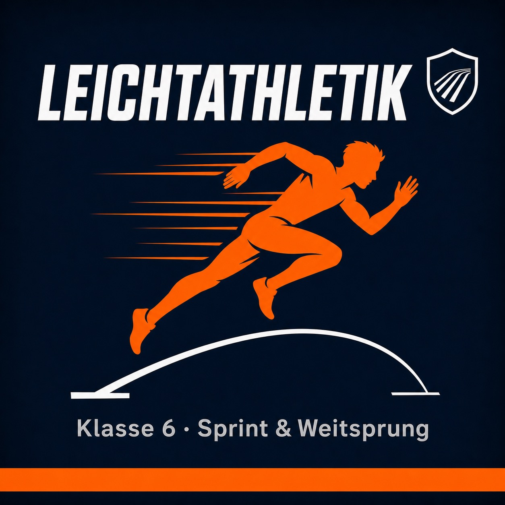

  

<h1 align="center">⚡ Leichtathletik – Klasse 6</h1>

  
  
  
  

  
  
  
  
  

---

## 📌 Bildungsplanverankerung BP 2016 BW

> Pflichtbereich **3.1.1.2 Laufen, Springen, Werfen** (Klassen 5/6)  
> Gemeinschaftsschule BW – [Bildungsplan 2016](https://www.bildungsplaene-bw.de/,Lde/BP2016BW_ALLG_SEK1_SPO_IK_5-6_01_02)

### Inhaltsbezogene Kompetenzen (IK) – Sprint & Weitsprung

Die SuS können …

| Kompetenz | Sprint | Weitsprung |
|---|:---:|:---:|
| … grundlegende Formen des **Laufens und Springens** situations- und aufgabengerecht anwenden | ✅ | ✅ |
| … ihre **Bewegungshandlungen** beschreiben und reflektieren | ✅ | ✅ |
| … **Körpererfahrungen** (Schnelligkeitserlebnisse, Sprungerlebnisse) bewusst wahrnehmen und verbalisieren | ✅ | ✅ |
| … beim Üben und Wettkämpfen **Regeln und Sicherheitsaspekte** einhalten | ✅ | ✅ |
| … mit einem **Partner / in einer Gruppe** kooperieren und Feedback geben | ✅ | ✅ |
| … ihre **individuelle Leistung** (Zeit, Weite) einschätzen und Fortschritte erkennen | ✅ | ✅ |

### Prozessbezogene Kompetenzen (PK) – Bezüge

| PK-Bereich (BP 2016) | Umsetzung im Vorhaben |
|---|---|
| **Wahrnehmen & Erleben** | Schnelligkeits- und Sprungerfahrungen durch Spiele (Körpergefühl) |
| **Leisten & Gestalten** | Persönliche Bestzeiten/-weiten als Lernziel, kein Ranking |
| **Spielen & Kooperieren** | Spielformen, Staffeln, Teamrollen |
| **Urteilen & Entscheiden** | Selbsteinschätzungsraster, Peer-Feedback |
| **Gesundheit & Wohlbefinden** | Aufwärmen, Dehnroutinen, Belastung & Erholung bewusst wahrnehmen |

### Mehrperspektivität (BP 2016 Sport)

Das Vorhaben greift bewusst **mehrere Sinnperspektiven** des Sportunterrichts auf (vgl. Kurz 2008 / BP 2016):

- 🏆 **Leistung** – persönlicher Fortschritt, Bestzeiten ohne Notenangst
- 🎮 **Spielen** – Spielleichtathletik als zentrales Vermittlungsprinzip
- 🤝 **Gemeinschaft** – Teamstaffeln, Beobachterrollen, Fairplay
- 🫀 **Gesundheit** – Körperwahrnehmung, Auf-/Abwärmen
- 🎭 **Erlebnis** – Körpererfahrungen durch Fangen, Springen, Reagieren

---

## 📋 Überblick

| | Sprint | Weitsprung |
|---|---|---|
| **Doppelstunden** | 4 | 1 |
| **BP-Bereich** | 3.1.1.2 Laufen, Springen, Werfen | 3.1.1.2 Laufen, Springen, Werfen |
| **Niveaustufen GMS** | M (Basis) · E (Erweiterung) | M (Basis) · E (Erweiterung) |
| **Vermittlungsprinzip** | induktiv / spielorientiert | induktiv / spielorientiert |
| **Ort** | Sportplatz / Halle | Sprunggrube / Halle (Matten) |
| **Quellen** | Skript LA (Wastl/Wollny) · BP 2016 | J+S Lektion 4 & 18 (BASPO) · BP 2016 |

---

## ♿ Inklusion & Differenzierung (BP 2016: Differenzieren & Individualisieren)

> 💡 **Inklusionstipp:** SuS mit motorischem Förderbedarf erhalten eine **Helfer-Karte** (3 Beobachtungsmerkmale in Bildform) und übernehmen die Beobachter*in- oder Zeitnehmer*in-Rolle – vollständige Teilhabe auch ohne eigenen Sprint/Sprung.

| Dimension | 🟢 Niveaustufe M – Basis | 🔵 Niveaustufe E – Erweiterung |
|---|---|---|
| **Distanz** | kürzere Strecken (15–20 m) | längere Strecken, engere Zonen |
| **Startform** | Hochstart | Tiefstart, Startblock |
| **Anlauf Weitsprung** | 4–6 Schritte, breite Zonen | 8–10 Schritte, enge Zonen |
| **Rolle** | Beobachter*in, Zeitnehmer*in | Gruppen-Coach, Eigenanalyse |
| **Signal** | akustisch (Pfiff) | optisch / taktil |
| **Aufgabe** | sichere Ausführung | Technik verbessern, eigene Station planen |
| **Taktile Hilfe** | LP / Partner begleitet Bewegung | selbstständige Videoanalyse |

---

## 🏃 Vorhaben 1: Sprint

  
  

### Materialien Sprint

- Hütchen / Markierungsteller (viele)
- Startblock (optional, 1–2 Stück)
- Baustellenband / Flatterband
- Spielkarten, Tennisbälle / kleine Gegenstände
- Stoppuhren oder Smartphone-App
- ggf. Tablet für Videoanalyse

---

### DS 1 – Einstieg & Hochstart

**BP-Bezug:** Körpererfahrungen durch Schnelligkeitserlebnisse · Leisten & Gestalten (persönliche Bestzeit)

#### Erwärmung (15 Min): Schwarz-Weiß-Sprint

Zwei Teams stehen sich auf zwei Linien (~3 m Abstand) gegenüber.  
LP ruft „**Schwarz**" oder „**Weiß**" → genanntes Team sprintet zur Grundlinie, anderes verfolgt.  
Wer vor der Linie abgetippt wird: 1 Punkt für das Fänger-Team.

- 🟢 Beide laufen in dieselbe Richtung; wer zuerst ankommt, gewinnt.
- 🔵 LP ruft Rechenaufgabe – Ergebnis bestimmt, wer fängt (z. B. „4+3 = Weiß").

#### Hauptteil 1 (20 Min): Diagnostik 30 m

- Kleingruppen à 3–4 SuS · 1–2 Versuche · Zeitmessung per Smartphone.
- **Keine Rangliste** – Zeit nur für sich notieren (BP 2016: angemessener Umgang mit Leistung).
- Reflexion: „Wie war dein Start? Hast du dich schnell gefühlt?"

#### Hauptteil 2 (35 Min): Hochstart-Stationen

| Station | Übung | Fokus | Quelle |
|---|---|---|---|
| A | **Fallstart** – nach vorne kippen, lossprinten | Startbein finden | Skript LA S. 6 |
| B | **Hochstart Grundform** – Startbein vorne, Knie gebeugt, Vorlage | Explosion nach vorne | Skript LA S. 6 |
| C | **Starts aus Lagen** – Bauchlage, Rückenlage, Hocke, Langsitz | Reaktion, Varianz | Skript LA S. 9 |
| D | **Startsignal-Wechsel** – akustisch / optisch / taktil | Reaktionszeit | Skript LA S. 9 |

4 Gruppen rotieren alle 7 Min. Eine Person startet, eine beobachtet, eine stoppt die Zeit.

- 🟢 Nur Station A + B, engere Bahnen, LP begleitet taktil.
- 🔵 Fallstart → 30-m-Sprint mit Zeitmessung, eigene Bestzeit verbessern.

#### Abschluss (10 Min): Pendelstaffel 4×20 m

Abklatschen, kein Stab. Fokus: faires Starten, eigene Spur halten.

---

### DS 2 – Tiefstart & Beschleunigung

**BP-Bezug:** Bewegungshandlungen beschreiben · Kooperieren & Feedback geben

#### Erwärmung (15 Min): Schere-Stein-Papier-Sprint 🎮

Zwei Reihen gegenüber (~2 m Abstand). Auf „1–2–3" Figur zeigen.  
Gewinner*in sprintet zur Grundlinie des Verlierers. Teamvariante: Punkte sammeln. (Skript LA S. 9)

#### Hauptteil 1 (25 Min): Tiefstart

1. **Dreipunktstart** – eine Hand, zwei Füße → auf Signal explosiv
2. **Vierpunktstart** – „Auf die Plätze / Fertig / Los"-Kommandos üben
3. **Tandem-Fehlerkorrektur** – Beobachtungskarte (Skript LA S. 7–8):
   - ✅ Becken nicht zu hoch / tief
   - ✅ Vorlage beibehalten (kein schnelles Aufrichten)
   - ✅ Arme aktiv schwingen

- 🟢 Nur Dreipunktstart, 15 m, LP begleitet.
- 🔵 Startblock einstellen (eng / mittel / weit); Vor-/Nachteile vergleichen. (Skript LA S. 7)

#### Hauptteil 2 (30 Min): Beschleunigungsspiele

**🐇 Frühstarter** *(Skript LA S. 9)*  
LP legt einem von zwei SuS heimlich Gegenstand in die Hand → startet nach Ermessen; andere Person muss vor Markierung einholen.

**🪢 Baustellenbandfang** *(Skript LA S. 9)*  
Zwei SuS halten ~1,5 m Baustellenband hintereinander. Vordere Person lässt los → hintere holt ein.

**📍 Beschleunigungsstufen**  
Hütchen bei 10 / 20 / 30 m: bis 10 m gebeugt, bis 20 m halb aufgerichtet, ab 20 m aufrecht.

#### Abschluss (15 Min): 3 × 30 m · Reflexion: „Was macht deinen Start schneller?"

---

### DS 3 – Sprintspiele & Sprint-Challenge

**BP-Bezug:** Spielen & Kooperieren · Reaktions- und Aktionsschnelligkeit · Körpererfahrungen

#### Erwärmung (15 Min): Nummernwettlauf *(Skript LA S. 9)*

Teams bilden gemeinsam Kreis, gleichnummerierte Personen gegenüber.  
LP ruft Zahl → beide sprinten außen um den Kreis.  
**Mathe-Variante:** LP ruft Rechenaufgabe, Ergebnis läuft.

#### Hauptteil: Sprint-Stationen (55 Min)

| Station | Spiel | Material | BP-Bezug |
|---|---|---|---|
| 🃏 **Kartensprint** | Verdeckte Spielkarten am Streckenende – nur eigene Farbe. Team mit vollst. Satz gewinnt. | Spielkarten, Hütchen | Kooperieren, Strategie |
| ⚡ **Risikosprint** | Depots 10/20/30 m (10/20/30 Pkt.). 15-Sek-Zeitlimit. *(Skript LA S. 10)* | Hütchen, Stoppuhr | Selbsteinschätzung |
| 🐉 **Prinz-Drache-Burgfräulein** | Reaktionsfang: Prinz fängt Drache, Drache fängt Burgfräulein, Burgfräulein fängt Prinz. *(Skript LA S. 9)* | – | Reaktion, Körpererfahrung |
| 🧩 **Puzzle-Sprint** | Puzzleteile in der Mitte, Teams sprinten, holen je eines. *(Skript LA S. 9)* | Puzzle, Hütchen | Teamarbeit |
| 🪢 **Baustellenbandfang** | Kettenfang mit Band (immer neue Paare). *(Skript LA S. 9)* | Baustellenband | Beschleunigung |

Teams à 4–5 SuS · ~10 Min / Station.

- 🟢 Kürzere Distanzen, einfache Rollen.
- 🔵 SuS erfinden eigene Stationsregel und erklären sie der Gruppe.

#### Abschluss (15 Min): Punkte auswerten · Fairplay-Highlight benennen

---

### DS 4 – Staffel & Abschlusswettkampf

**BP-Bezug:** Leisten & Gestalten · angemessener Umgang mit Leistung · Gemeinschaft

#### Erwärmung (15 Min): Reflexions-Einlaufen + 3×30 m

„Was war dein Tipp für einen schnellen Start?" – Fragerunde beim Einlaufen.

#### Hauptteil 1 (25 Min): Staffelformen

1. **Pendelstaffel ohne Stab** – Abklatschen
2. **Staffel mit Stab** – Übergabe in markierter Zone, Empfänger läuft rechtzeitig los
3. **Variationen:** 4×30 m · 6×20 m · Hütchen-Slalom + Sprint

#### Hauptteil 2 (30 Min): Abschlusswettkampf

- Runde 1: Staffelsprint 4×30 m
- Runde 2: Teamwahl – ein Spiel aus DS 3

**Punkte:** 3 / 2 / 1 je Platzierung · +1 Bonus für Fairplay / bestes Teamfeedback  
*(BP 2016: alternative Formen der Leistungsmessung, Fairplay-Kompetenz)*

#### Abschluss (15 Min)

- Vergleich 30-m-Zeit DS 1 → DS 4 (optional, ohne Notencharakter, BP: Leistungsfortschritt erleben)
- Reflexion: „Was hat sich verbessert? Was nimmst du mit?"
- Lockeres Auslaufen, Dehnen (Oberschenkel, Waden, Schulter).

---

## 🦘 Vorhaben 2: Weitsprung

  
  

**BP-Bezug:** Körpererfahrungen durch Sprungerlebnisse · Leisten & Gestalten · Kooperieren · Sicherheit

### Materialien Weitsprung

- Hütchen / Markierungsteller
- Springseile (1 pro Kind)
- Dünne Turnmatten + 1–2 Weichbodenmatten
- Reifen (ca. 15–25 Stück)
- Schaumstoffblöcke / Bananenschachteln
- Sandgrube mit Rechen (Zinken nach unten lagern!)

---

### Stundenverlauf

#### Einstieg (10 Min): Hindernisfangis 🏃 *(J+S Lektion 18)*

Springseile als „Wände" auf dem Boden. Fänger*innen dürfen **durch** die Wände laufen, alle anderen müssen **drumherum oder drüberspringen**.  
Bei Fang: Spielband übergeben, neue Rolle übernehmen.

- 🟢 Fänger*innen dürfen auch drumherumgehen.
- 🔵 Fänger*innen dürfen ebenfalls springen.

#### Erwärmung (15 Min): Seil-Parcours zu Musik 🎵 *(J+S Lektion 4)*

Seile kreisförmig auf dem Boden (1 pro Kind). Musik läuft → kreuz und quer laufen.  
Musik stoppt → schnell zu einem Seil, beliebige Art drüberhüpfen.  
Nach einigen Runden: ein Seil entfernen – wer keinen Platz findet, hüpft auf einem Bein zur Wand, dann wieder frei.

#### Hauptteil 1: Sprung-Stationen (35 Min)

| Station | Spiel / Übung | BP-Bezug | Quelle |
|---|---|---|---|
| 🌊 **Seerosenblätter** | Matten = Blätter im „Fluss" (Seile als Ufer). Überqueren ohne ins Wasser zu treten. Wer stehenbleibt: Matte versinkt. | Sprungerlebnis, Kooperation | J+S Lektion 4 |
| ☔ **Pfützen überspringen** | 1 Pkt. quer, 2 Pkt. längs. Team- oder Einzelpunkte. | Absprungbewusstsein | J+S Lektion 4 |
| 📏 **Immer weiter!** | Schaumstoffblöcke mit steigendem Abstand (max. 3 Blöcke breit). Wer überspringt die breiteste? | Sprungweite, Tempoverlust | J+S Lektion 4 |
| 🃏 **Jasskartenstafette** | Matte-zu-Matte mit **Ta–Tam-Rhythmus**. Auf dicker Matte verdeckte Karte holen. Wer hat zuerst 4 gleiche? Variante: Memory. | Anlaufrhythmus, Reaktion | J+S Lektion 18 |
| 🧊 **Einfrieren** | Mattenbahn: „Gräben" überspringen, angewinkeltes Knie, möglichst lange in der Luft „einfrieren". | Flugphase, Körperstreckung | J+S Lektion 18 |

4–5 Gruppen · ~7 Min / Station.

- 🟢 Schmalere Hindernisse, mehr Anlauf erlaubt, Paararbeit.
- 🔵 Ta–Tam synchron zu zweit, kürzere Anläufe, Stilnoten vergeben.

#### Hauptteil 2 (20 Min): 5-Sprung-Challenge & Zonen-Weitsprung

**5-Sprung-Challenge** *(J+S Lektion 18)*  
25 Reifen mit wachsendem Abstand. Wer bewältigt die Bahn ohne Reifen zu berühren?  
~4 Anlaufschritte optimal. **Selbsteinschätzung** im Vordergrund. *(BP: Leistungsfortschritt erleben)*

**Zonen-Weitsprung** *(BP: angemessener Umgang mit Leistung)*

| Punkte | Kriterium |
|---|---|
| +1 | Beidbeinige Landung nach vorne (kein Abstützen) |
| +1 | Erkennbarer Ta–Tam-Rhythmus |
| +1–3 | Je nach Zone (Weite) |

**Rollen:** Springer*in · Beobachter*in (Merkmalkarte) · Punktezähler*in

#### Abschluss (10 Min): Skispringer-Landung 🎿 & Reflexion *(J+S Lektion 4)*

In Schrittstellung abspringen → **Telemark-Landung** (wie Skispringer*in).  
Qualität zählt, nicht Weite! LP vergibt spielerisch „Stilpunkte" 1–10.

Reflexion: „Was hat dir beim Springen geholfen? Was bedeutet Ta–Tam für deinen Körper?"

---

## ✅ Selbsteinschätzungsraster für SuS (BP 2016: Urteilen & Entscheiden)

### Sprint

| Kriterium | 🔴 Noch nicht | 🟡 Ich übe | 🟢 Kann ich sicher |
|---|:---:|:---:|:---:|
| Startbein richtig vorne | ○ | ○ | ○ |
| Vorlage beim Starten halten | ○ | ○ | ○ |
| Kein schnelles Aufrichten | ○ | ○ | ○ |
| Aktiver Armschwung | ○ | ○ | ○ |
| Explosiver Abdruck | ○ | ○ | ○ |

### Weitsprung

| Kriterium | 🔴 Noch nicht | 🟡 Ich übe | 🟢 Kann ich sicher |
|---|:---:|:---:|:---:|
| Anlauf wird schneller | ○ | ○ | ○ |
| Ta–Tam-Rhythmus spürbar | ○ | ○ | ○ |
| Absprung von einem Bein | ○ | ○ | ○ |
| Beidbeinige Landung nach vorne | ○ | ○ | ○ |
| Kein Abstützen nach hinten | ○ | ○ | ○ |

---

## 🔒 Sicherheitshinweise (BP 2016: Regelkompetenz)

- Sprint- und Laufwege **nie kreuzen**
- Starten **nur auf Signal**
- Sand auflockern, **Rechen Zinken nach unten** lagern
- Immer nur **eine Person** pro Bahn / Grube
- Matten in der Halle gegen Wegrutschen sichern
- Ausreichend Erholung zwischen intensiven Sprints

---

## 📚 Quellen & Grundlagen

| Quelle | Verwendung |
|---|---|
| **Bildungsplan 2016 BW** · [3.1.1.2 Laufen, Springen, Werfen](https://www.bildungsplaene-bw.de/,Lde/BP2016BW_ALLG_SEK1_SPO_IK_5-6_01_02) | Kompetenzverankerung, Mehrperspektivität |
| **Wastl / Wollny (2012)** · Skript Leichtathletik Kurs | Sprint, Starts, Spielformen, Kompetenzraster |
| **J+S-Kids Lektion 4** · BASPO (Thali / Weber) | Weitsprung-Einsteigerstunde |
| **J+S-Kids Lektion 18** · BASPO (Thali) | Weitsprung Aufbau, Ta–Tam-Rhythmus |
| **Katzenbogner / Medler** · Spielleichtathletik | Spielformen, Staffeln |
| **Kurz, K. (2008)** · Der Auftrag des Schulsports | Mehrperspektivität |

---

  
  
  

*Unterrichtsvorhaben Leichtathletik · Klasse 6 · Gemeinschaftsschule BW · Bildungsplan 2016 · ⚡ Sport & Technik*
